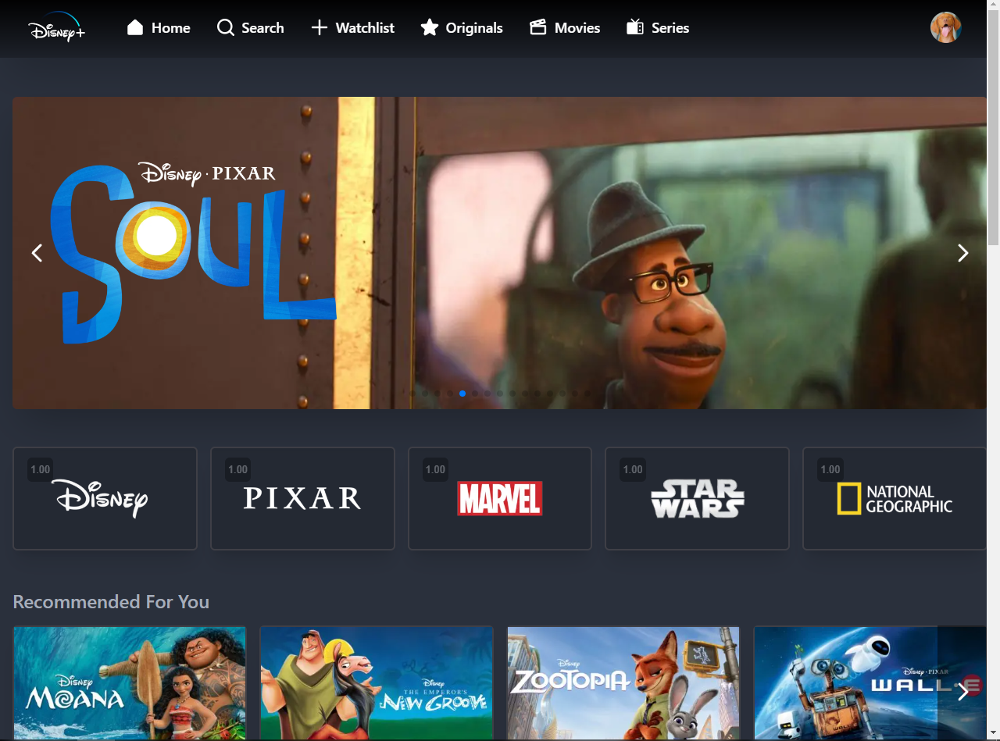
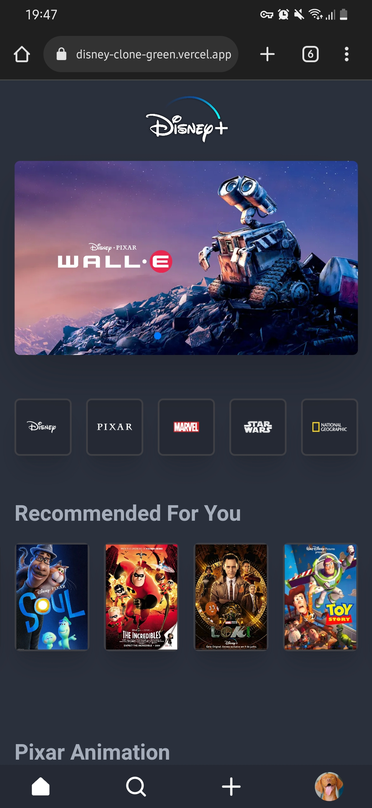
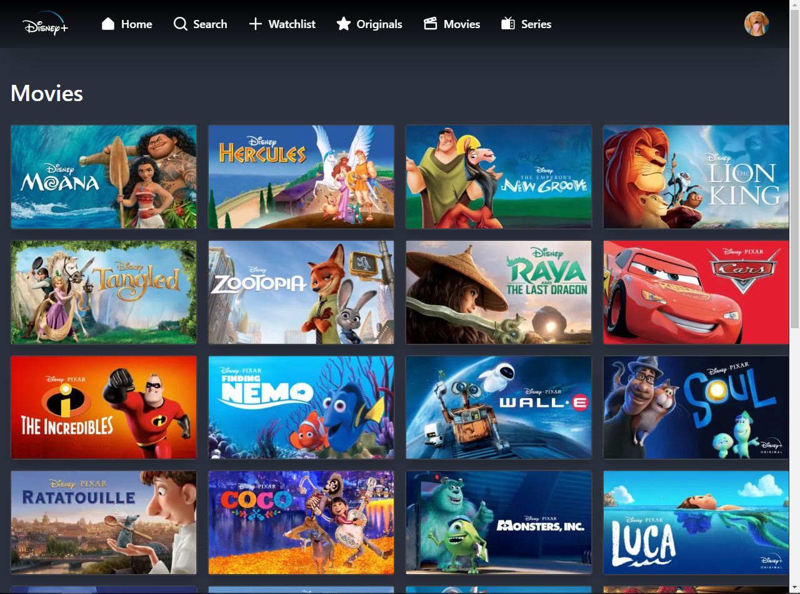
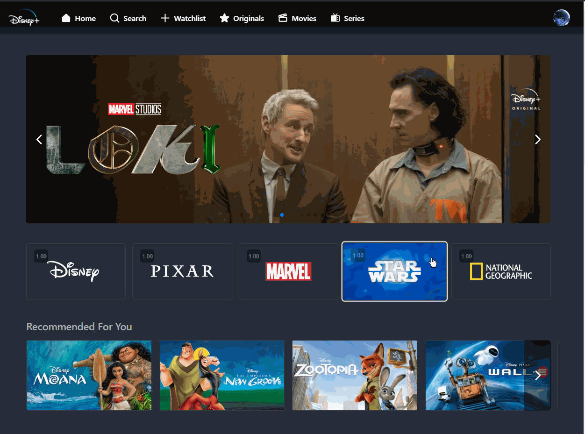

<div align="center">


<br />

# Disney+ clone

[](https://github.com/SlyCooper-n)
[](https://github.com/SlyCooper-n/disney-clone/blob/main/package.json)
[](https://github.com/SlyCooper-n/disney-clone/issues)
[](https://github.com/SlyCooper-n/disney-clone/blob/main/LICENSE)
[](https://github.com/SlyCooper-n/disney-clone/commits/main)
[](http://commitizen.github.io/cz-cli/)

</div>

<br />

> This was generated by [bash scripts](https://github.com/SlyCooper-n/models) to start with a Next.js template. <br />
> Live demo [here](https://disney-clone.vercel.app).

## Table of Contents

- [Disney+ clone](#disney-clone)
  - [Table of Contents](#table-of-contents)
  - [:pushpin: General Information](#pushpin-general-information)
  - [:hammer: Technologies I Used](#hammer-technologies-i-used)
  - [:sparkles: Features](#sparkles-features)
    - [:eye: Curious to see what is coming next?](#eye-curious-to-see-what-is-coming-next)
  - [:camera: Screenshots](#camera-screenshots)
  - [:rocket: Running this project](#rocket-running-this-project)
    - [:brain: Thinking of contributing to the project?](#brain-thinking-of-contributing-to-the-project)
  - [:heavy_check_mark: Project Status](#heavy_check_mark-project-status)
  - [:white_heart: Acknowledgement](#white_heart-acknowledgement)
  - [:memo: License & Contact](#memo-license--contact)
<!-- - [Usage](#question-usage) -->
- [Project Status](#heavy_check_mark-project-status)
- [Acknowledgement](#white_heart-acknowledgement)
- [License & Contact](#memo-license--contact)

## :pushpin: General Information

One more Disney+ clone is alive now!

I didn't want to build another big-company website copy but when I saw [Ania's video](https://www.youtube.com/watch?v=u1ovHJXkPBY) and the opportunity to learn and practice different concepts on my way there, I had to do it. So, this project was made exclusively to practice GraphQL on the client side and managing content with Hygraph.

> For more information about my dev journey, consider visiting my [LinkedIn](https://linkedin.com/in/gabriel-vs-frasao).

## :hammer: Technologies I Used

<details>
<summary>
Base tools
</summary>

- [React](https://reactjs.org/) v18.2.0
- [Next.js](https://nextjs.org/) v12.2.5
- [TypeScript](https://www.typescriptlang.org/) v4.8.2
- [Firebase](https://firebase.google.com/) v9.9.4
- [Hygraph](https://hygraph.com/)
- [Apollo Client](https://www.apollographql.com/) v3.6.9

</details>

<details>
<summary>
Styling
</summary>

- [Tailwind](https://tailwindcss.com/) v3.1.8
- [DaisyUI](https://daisyui.com/) v2.24.0
- [RadixUI](https://www.radix-ui.com/) (version per component)

</details>

<details>
<summary>
Linters and Formatters
</summary>

- [ESLint](https://eslint.org/) v8.23.0
- [Prettier](https://prettier.io/) (VS Code extension)
- [.editorConfig](https://editorconfig.org/) (VS Code extension)

</details>

<details>
<summary>
Testing
</summary>

- [Vitest](https://vitest.dev/) v0.22.1
- [React testing library](https://testing-library.com/docs/react-testing-library/intro/)
  - jest-dom v5.16.5
  - react v13.3.0
  - user-event v14.4.3
- [Cypress](https://www.cypress.io/) v10.7.0

</details>

## :sparkles: Features

- [x] Authentication with Google
- [x] Create up to 4 profiles per account
- [x] Add/remove videos from watchlist

### :eye: Curious to see what is coming next?

[Stay tuned right here](https://github.com/users/SlyCooper-n/projects/04)

## :camera: Screenshots






## :rocket: Running this project

**Clone on your machine** (I personally use Github CLI)

```bash
# by git
git clone https://github.com/SlyCooper-n/disney-clone.git

# or by Github CLI
gh repo clone SlyCooper-n/disney-clone
```

**Set every thing up**

```bash
# enter the project folder
cd disney-clone

# install dependencies
npm install

# run on development mode
npm run dev
```

### :brain: Thinking of contributing to the project?

Clone the repo as shown above :arrow_up: and follow [this little guide](https://github.com/SlyCooper-n/disney-clone/blob/main/_docs/CONTRIBUTING.md)

## :heavy_check_mark: Project Status

Project is: In Progress :construction:

| Status | Project |
| ------ | ------- |
|  | [disney-clone](https://disney-clone.vercel.app) |

## :white_heart: Acknowledgement

- ***disney-clone*** was based and inspired on [this one](https://github.com/kubowania/disney-clone-graphcms).
- Many thanks to [Ania Kubów](https://github.com/kubowania).

## :memo: License & Contact

[MIT License](https://github.com/SlyCooper-n/disney-clone/blob/main/LICENSE) &copy; [Gabriel VS Frasão](https://github.com/SlyCooper-n)

Feel free to get in touch with me on my [Gmail](mailto:gabrielvitor.frasao@gmail.com), [Instagram](https://instagram/gabe_frasz) or [LinkedIn](https://linkedin.com/in/gabriel-vs-frasao)
